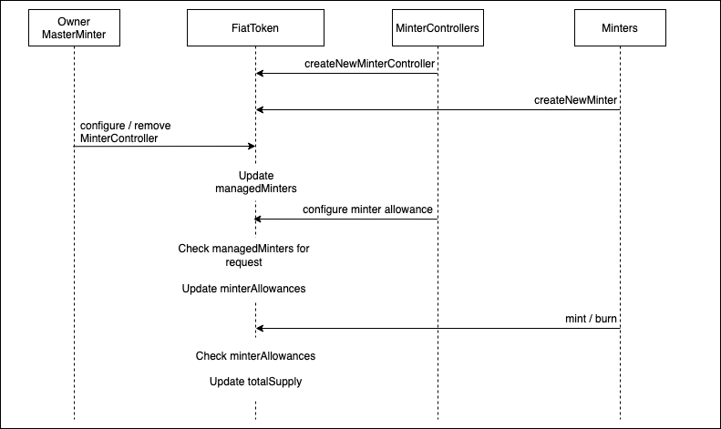
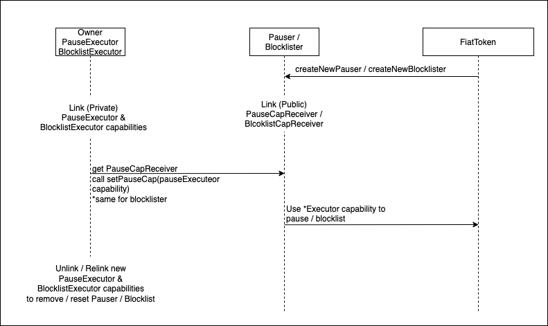

# Resource Interactions

<!-- markdownlint-configure-file { "MD013": { "line_length": 200} } -->

There are total of 9 resources in `FiatToken`:

- `owner`: with functions to create `MasterMinter`, `PauseExecutor` and `BlocklistExecutor`
- `PauseExecutor`: has capability to pause and unpause the contract
- `BlocklistExecutor`: has the capability to blocklist / unblocklist a resource
- `MasterMinter`: sets the pairing between `MinterController` and `Minter`
- `MinterController`: sets `Minter` allowances and remove them
- `Minter`: mints and burns tokens
- `Pauser`: receives `PauseExecutor` capability to call for pause / unpause
- `Blocklister`: receives `BlocklistExecutor` capability to call for blocklist / unblocklist
- `Vault`: stores, recieve, withdraw, and set allowances for FiatToken

There on 3 delegation processes from the owner, minting, pause, blocklist.
The latter 2 are very similar and will be described in the same diagram below.

